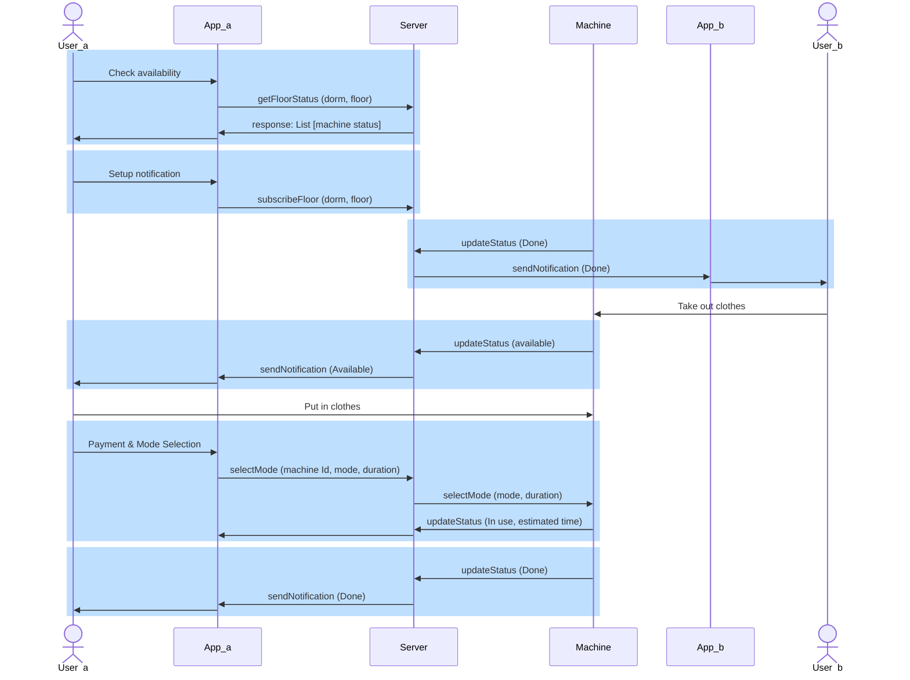

Backend Specification
===
## Sequence diagram

- App
  - Get machine status from server and display
  - Payment process
  - Record user preferences
- Server
  - Record machine status
  - Record notification subscription
  - Send commands to machine
  - Send notification (firebase messaging)
- Machine
  - Send status to server
  - Receive commands from server

## Protocols
### Types of protocols
| Protocol | How it works | Limitations |
| - | --- | -
| HTTP (request-response) | Client send GET or POST request to server, then server reply with a response. | Server can not communicate with client without request. | 
|Pub/Sub | Subcriber subscribe to a topic, publisher can publish  updates, and subscriber will get notified. | Subscriber cannot send command to publisher.
| Web socket | Client can connect to server by sending request. Afterwards, client and server can send message to each other many times without a request. |

### Plan
- App <-> Server: Http + Firebase messaging
- Server <-> Machine: Websocket

## API
### App -> Server
- GET getFloorStatus (dorm)
  - Server: query machine status by dorm
  - response: List [machine status {id, status, estimated time, time passed}]
- POST subscribeFloor (dorm, floor)
  - Server: add (App id, dorm_floor) subscriptions
  - response: OK if success
- POST selectMode (machine Id, mode, duration)
  - Server: add (App id, machine_id) subscriptions
  - Server: selectMode -> Machine
  - Machine: updateMachineStatus
  - Server: remove (App id, dorm_floor) subscriptions
  - response: machine status {id, status, estimated time, time passed}

### Server -> App (Firebase messaging)
- sendNotification (machine status)

### Machine -> Server
- updateStatus (status, estimated time)
  - Available, In use, Done/Overdue
  - Server: Update (machine id, status, estimated time, last update)
  - If (in use -> overdue) 
    - sendNotification(laundry done) to App subscribed to machine id
  - If (overdue -> available) 
    - remove (app id, machine id) subscriptions
    - sendNotification(machine available) to App subscribed to dorm, floors
  - If (available -> In use)
    - Response to app 

### Server -> Machine
- selectMode (mode, duration)

## Database
### Server
- Machine Status
  - Machine Id
  - Dorm, floors
  - Status
  - Estimated time
  - Last update
- Subscriptions
  - App Id
  - Dormitory, floors
  - Machine Id
 
## Discussion
1. Do we have to implement Machine <-> Server during Hi-fi prototyping?
    - Machine simulation:
      - Hardware client with websocket
      - Web client from another port with websocket
      - Web client with direct access to server
    - No simulation
2. Are we going to support machines without built-in functions?
    - Workaround for updateStatus
        - Manual update by user
        - Detect current (with additional sensor)
3. Server & Database selection
    - Cloud (Firebase)
    - Local 